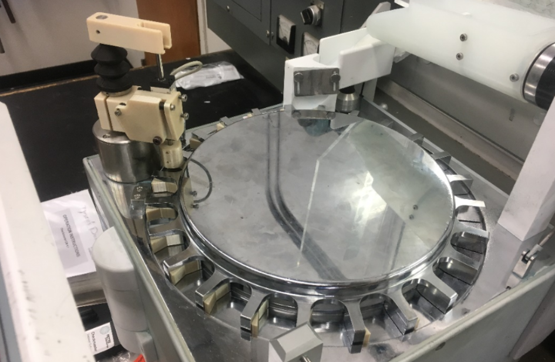

# Braedin Butler 
## Mechanical/Aerospace Engineer
### Engineering Portfolio 

### PPG Smoke LLC
##### February 2020 - Present
### Project Leader, Computer Engineer, and Mechanical Engineer
#### Active Noise Cancelling Headset
I designed and built a working prototype of an active noise canelling headset, both the circuit board and the injection molded housing. This headset allows for communication via bluetooth phone call and aviation radio during flight. The headset offers active and passive hearing protection, which is especially helpful while operating loud aircraft.

#### Paramotor Smoke System
Image of me test flying the smoke system prototype I designed and built. I designed a circuit board to control the speed of a DC motor which injects baby oil into the exhaust of a paramotor. After passing through the hot exhaust pipe, the baby oil exits as a thick cloud of white smoke. Smoke displays are perfect during acrobatic paramotor routines and air shows.

  

### Autoliv
##### May 2019 - October 2019
### Process Engineer Summer Intern
#### High precision tablet measuring device
This device automatically measures the thickness of explosive tablets used in airbag systems. Since the geometry of each tablet is critical for controling burn rate, tablets must be held to a tight tolerance. this device had issues of imprecise measurements due to play in the mechanical parts. I was hired as an intern to fix this issue. I designed new parts that had zero play and I implemented a way to easily adjust and calibrate the machine.

