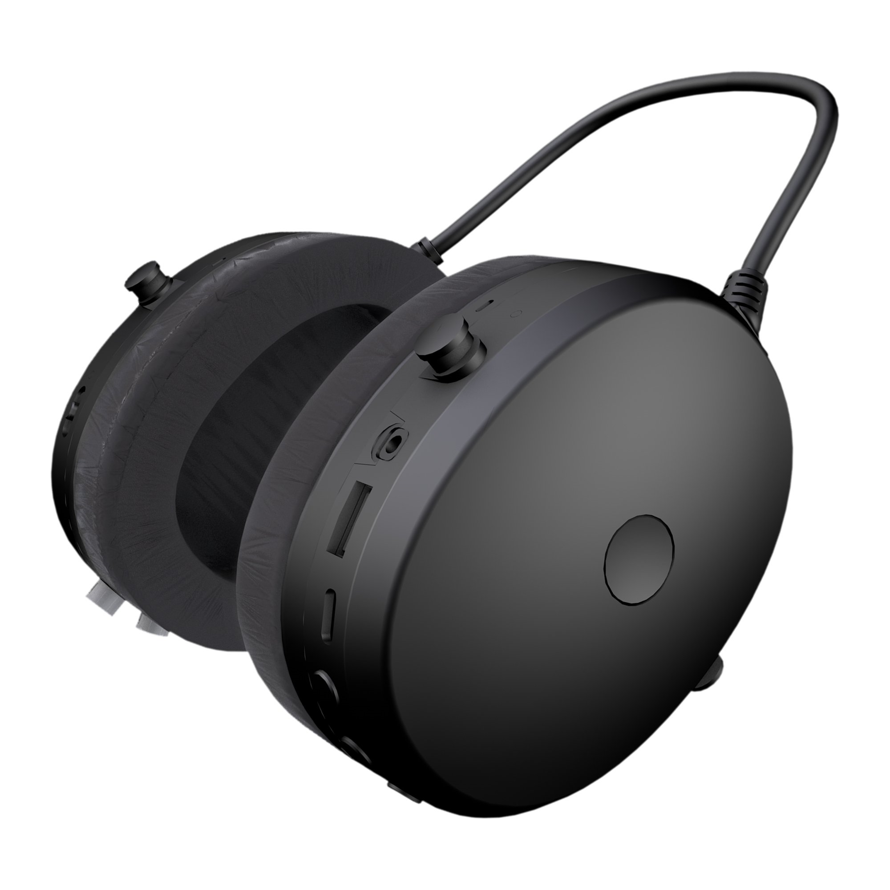
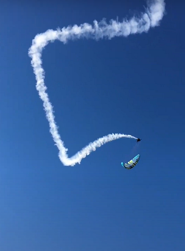
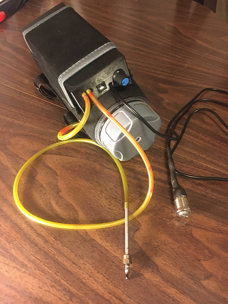

# Braedin Butler 
## Mechanical/Aerospace Engineer
### Engineering Portfolio 

### PPG Smoke LLC
##### February 2020 - Present
### Project Leader, Computer Engineer, and Mechanical Engineer
#### Active Noise Cancelling Headset
Designed and built a working prototype, both the circuit board and the injection molded housing.

#### Paramotor Smoke System
Image of me test flying the smoke system prototype I designed and built.

  
