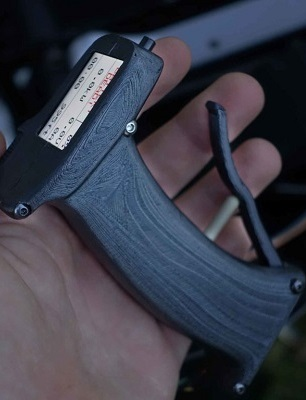

# Braedin Butler 
## Mechanical/Aerospace Engineer
### Engineering Portfolio 

## PPG Smoke LLC
##### February 2020 - Present
### Project Leader, Computer Engineer, and Mechanical Engineer
#### Active Noise Cancelling Headset
I designed and built a working prototype of an active noise cancelling headset, both the circuit board and the injection molded housing. This headset allows for communication via bluetooth phone call and aviation radio during flight. The headset offers active and passive hearing protection, which is especially helpful while operating loud aircraft.

#### Paramotor Smoke System
This is an image of me test flying the smoke system prototype I designed and built. I designed a circuit board to control the speed of a DC motor which injects baby oil into the exhaust of a paramotor. After passing through the hot exhaust pipe, the baby oil exits as a thick cloud of white smoke. Smoke displays are perfect during acrobatic paramotor routines and air shows.

  

## Autoliv
##### May 2019 - October 2019
### Process Engineer Summer Intern
#### High precision tablet measuring device
This device automatically measures the thickness of explosive tablets used in airbag systems. Since the geometry of each tablet is critical for controling burn rate, tablets must be held to a tight tolerance. This device had issues of imprecise measurements due to play in the mechanical parts. I was hired as an intern to fix this issue. I designed new parts that had zero play and I implemented a way to easily adjust and calibrate the machine.

## OpenPPG
##### December 2017 - Present
### Hardware and Firmware Engineer
#### Electric Paramotor Throttle Controller
Starting out as a volunteer for this open source project, I designed and assembled a circuit board that communicates with an electronic speed controller for an electric paramotor. The throttle has a screen that displays telemetry data collected from the paramotor such as battery level, RPM, electrical current, battery temperature, and altitude. I also wrote the firmware for the throttle controller, packed full of useful features like beginner and expert mode, cruise control, and vibration feedback for warning the pilot of low battery or a hot speed controller. My skills with electronics and PCB design are completely self taught.

 

## Creator of v^Speed Vario
##### May 2017 - Present
### Hardware and Firmware Engineer
#### Open Source Flight Instrument
During the summer of 2017, I caught the electronics bug. I found a passion for designing circuit boards and seeing them come to life after uploading code. I began learning everything I could about electronics and designing circuit boards, mostly from watching YouTube. I couldn't believe how much I learned. Later that summer, I produced several prototypes of an open source variometer for paragliding. A variometer is a flight instrument that indicates whether the aircraft is gaining altitude or losing altitude, which is extremely helpful for sports like paragliding and hang gliding. The variometer I created is the most affordable bluetooth enabled variometer on the market.

